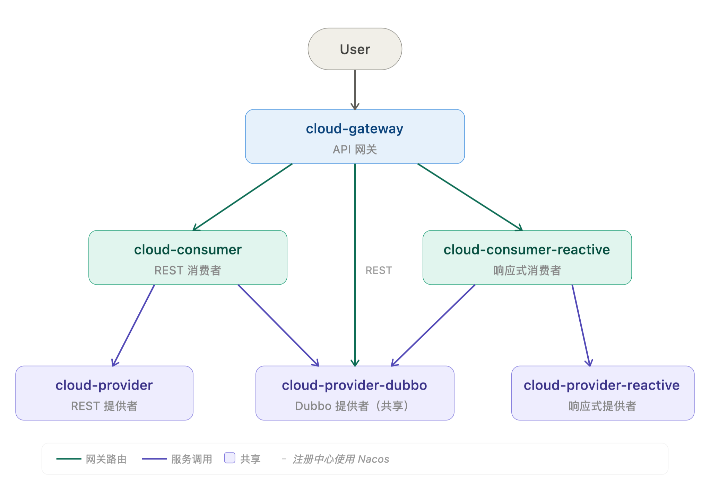

# Spring Cloud Alibaba Samples
Spring Cloud 生态研究（Based on **Spring Boot 3.5.x** and **Spring Cloud Alibaba 2025.0.x**） <br>
以生产环境可参考为目标，打造一个完整的 Spring Cloud 示例项目。

### 模块介绍
| 模块                             | 简称                | 端口    | 说明                    |
|--------------------------------|-------------------|-------|-----------------------|
| cloud-gateway-sample           | gateway           | 8764  | Spring Cloud Gateway  |
| cloud-consumer-sample          | consumer          | 8766  | Web Consumer          |
| cloud-provider-sample          | provider          | 8765  | Web Provider          |
| cloud-consumer-reactive-sample | consumer-reactive | 8763  | Reactive Web Consumer |
| cloud-provider-reactive-sample | provider-reactive | 8762  | Reactive Web Provider |
| cloud-provider-dubbo-sample    | provider-dubbo    | 50051 | Dubbo Provider        |
| cloud-consumer-dubbo-sample    | consumer-dubbo    | -     | Dubbo Consumer        |
| cloud-sample-api               | api               | -     | interface             |
| cloud-nacos-config-sample      | config            | 8761  | Nacos Config          |
| cloud-stream-sample            | stream            | -     | Spring Cloud Stream   |

<picture>
  <source srcset="arch.svg" type="image/svg+xml">
  
</picture>

### 服务注册与发现演示
首先安装部署nacos，请参考 nacos.io

#### 普通Web服务的注册与发现
依次启动provider,consumer,gateway <br>
直接访问(consumer → provider)
```shell
curl 'http://localhost:8766/hi?name=hongxi'
```
通过网关访问(gateway → consumer → provider)
```shell
curl 'http://localhost:8764/consumer-sample/hi?name=hongxi'
```

#### Reactive Web 服务注册与发现
接着启动provider-reactive,consumer-reactive <br>
直接访问(consumer-reactive → provider-reactive)
```shell
curl 'http://localhost:8763/hi?name=hongxi'
```
通过网关访问(gateway → consumer-reactive → provider-reactive)
```shell
curl 'http://localhost:8764/consumer-reactive-sample/hi?name=hongxi'
```

#### dubbo 服务注册与发现
接着启动provider-dubbo <br>
直接访问(consumer → provider-dubbo)
```shell
curl 'http://localhost:8766/dubbo?name=hongxi'
```
通过网关访问(gateway → consumer → provider-dubbo)
```shell
curl 'http://localhost:8764/consumer-sample/dubbo?name=hongxi'
```
直接访问(consumer-reactive → provider-dubbo)
```shell
curl 'http://localhost:8763/dubbo?name=hongxi'
```
通过网关访问(gateway → consumer-reactive → provider-dubbo)
```shell
curl 'http://localhost:8764/consumer-reactive-sample/dubbo?name=hongxi'
```

### 脚本演示
启动所有服务（脚本最后会执行curl并输出响应结果）
```shell
sh start-all.sh
```
停止所有服务
```shell
sh start-all.sh stop
```

### 网关访问dubbo演示
启动provider-dubbo,gateway<br>
直接访问`dubbo rest`接口
```shell
curl http://localhost:50051/api/hello/lily
curl 'http://localhost:50051/api/add?a=1&b=2'
curl -X POST http://localhost:50051/api/echo -H "Content-Type: application/json" -d '{"message":"hi"}'
curl 'http://localhost:50051/api/greet/lily?lang=zh'
```
通过网关访问`dubbo rest`接口(gateway → provider-dubbo)
```shell
curl http://localhost:8764/provider-dubbo-sample/api/hello/lily
curl 'http://localhost:8764/provider-dubbo-sample/api/add?a=1&b=2'
curl -X POST http://localhost:8764/provider-dubbo-sample/api/echo -H "Content-Type: application/json" -d '{"message":"hi"}'
curl 'http://localhost:8764/provider-dubbo-sample/api/greet/lily?lang=zh'
```

### sentinel gateway 演示
`cloud-gateway-sample`集成了sentinel，并采用nacos配置规则，规则示例如下 <br>
group-id: SENTINEL_GROUP <br>
data-id: cloud.sample.gateway.gw-api-group
```json
[
  {
    "apiName": "consumer_reactive_api",
    "predicateItems": [
      {
        "pattern": "/consumer-reactive-sample/**",
        "matchStrategy": 1
      }
    ]
  },
  {
    "apiName": "consumer_api",
    "predicateItems": [
      {
        "pattern": "/consumer-sample/**",
        "matchStrategy": 1
      }
    ]
  }
]
```
group-id: SENTINEL_GROUP <br>
data-id: cloud.sample.gateway.gw-flow
```json
[
  {
    "resource": "consumer_reactive_api",
    "resourceMode": 1,
    "count": 10
  },
  {
    "resource": "consumer_api",
    "resourceMode": 1,
    "count": 5
  },
  {
    "resource": "consumer-reactive-sample",
    "resourceMode": 0,
    "count": 20
  }
]
```
演示：在浏览器快速刷新访问几次如下接口
```text
http://localhost:8764/consumer-sample/hi?name=hongxi
```
触发限流时返回
```json
{"code":444,"msg":"Sentinel gateway block"}
```

### Stream 演示
#### Run RocketMQ locally
download [rocketmq-all-5.5.0-bin-release.zip](https://dist.apache.org/repos/dist/release/rocketmq/5.5.0/rocketmq-all-5.5.0-bin-release.zip)
```shell
bin/mqnamesrv
bin/mqbroker -n localhost:9876 --enable-proxy
```

#### Create Topic and Consumer Group
```shell
bin/mqadmin updateTopic -n localhost:9876 -c DefaultCluster -t stream-demo-topic -a +message.type=NORMAL
bin/mqadmin updateSubGroup -n localhost:9876 -c DefaultCluster -g stream-demo-consumer-group
```

#### Run Demo
启动`stream`，观察日志

&copy; [hongxi.org](http://hongxi.org)
